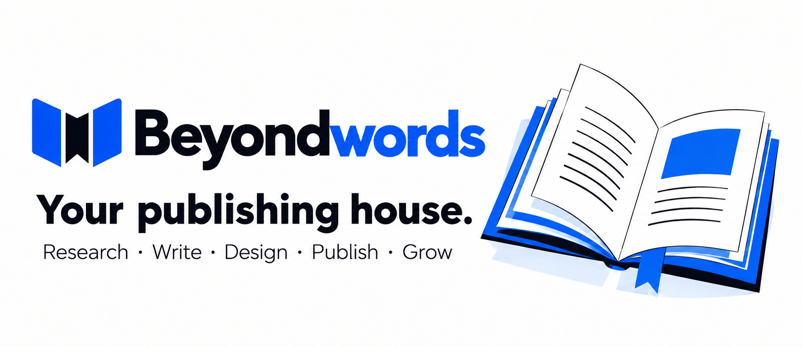
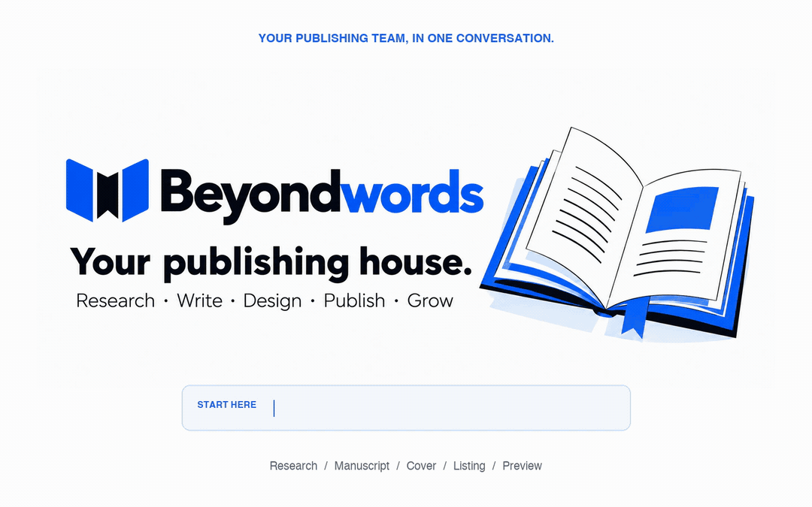
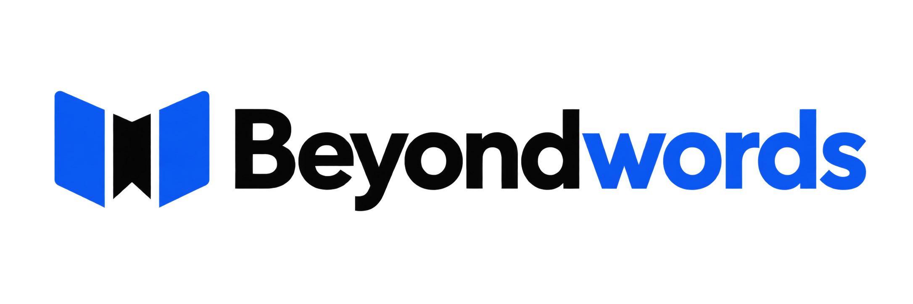

<p align="center">
  
</p>

<p align="center">
  <strong>One publishing team. From your first idea to your next reader.</strong><br>
  An open-source skill and local toolkit for people who want to make books worth reading.
</p>

<p align="center">
  <a href="https://github.com/beyondtahir/beyondwords/releases/tag/v1.1.0"></a>
  <a href="LICENSE"></a>
  <a href="docs/INSTALL.md"></a>
  <a href="https://github.com/beyondtahir/beyondwords/actions/workflows/package.yml"></a>
</p>

<p align="center">
  <a href="#see-it-in-action"><strong>Watch</strong></a> ·
  <a href="#install-in-your-assistant"><strong>Install</strong></a> ·
  <a href="docs/CAPABILITIES.md"><strong>Capabilities</strong></a> ·
  <a href="docs/TECHNICAL.md"><strong>Under the hood</strong></a> ·
  <a href="https://www.beyondtahir.com"><strong>Beyond Tahir</strong></a>
</p>

---

## Bring the idea. Build the book. Keep moving.

You might have a manuscript. You might have a subject you love. You might simply want to publish your first book and have no idea where to begin.

**Beyondwords meets you there.** It works inside your AI assistant as a conversational publishing team: researcher, writing partner, editor, designer, production assistant and marketing guide. It asks useful questions, remembers your selected project and helps you finish the next meaningful step.

The skill is backed by executable local tools for evidence, manuscripts, book files, account workflows and reporting. Your assistant supplies the intelligence; Beyondwords gives the work structure, continuity and practical outputs.

## See it in action

<p align="center">
  <a href="assets/beyondwords-how-it-works.mp4"></a>
</p>

<p align="center"><strong>Research → Create → Design → Prepare → Preview</strong><br>
<a href="assets/beyondwords-how-it-works.mp4">Watch the sharper MP4</a> · <a href="assets/beyondwords-tutorial-poster.png">View the still preview</a></p>

The walkthrough uses edited screen recordings of a book project. It shows selected steps, including a labeled cover still; it does not represent a full installation, advertising campaign or sales result.

## A publishing house inside your workflow

<table>
<tr>
<td width="50%" valign="top">

### 01 · Find the reader and the idea

Research comparable books, permitted previews and actual reader feedback. Explore **five researched niches with an idea for each**, or **five ideas within your chosen niche**. See the gaps, contrary evidence and a useful next experiment.

</td>
<td width="50%" valign="top">

### 02 · Write something with a voice

Build an original writing persona around the book, its reader and your creative direction. Approve a sample, develop an outline and draft chapter by chapter. Keep characters, facts, promises and unresolved story threads consistent.

</td>
</tr>
<tr>
<td width="50%" valign="top">

### 03 · Edit beyond the surface

Review structure, logic, repetition, voice and factual claims. Tie review notes to the actual manuscript version. Prepare clear handoffs for independent editors and real readers, then turn their feedback into focused revisions.

</td>
<td width="50%" valign="top">

### 04 · Design for the shelf

Study relevant covers and create original directions using available image tools. Compose editable typography, check native pixels and plan the front, spine and back against the selected print specification.

</td>
</tr>
<tr>
<td width="50%" valign="top">

### 05 · Produce useful book files

Prepare supported **EPUB, print PDF and editable DOCX** outputs. Assemble illustrated or coloring pages, inspect contact sheets and check dimensions. Keep ebook and paperback decisions connected to the actual reading experience.

</td>
<td width="50%" valign="top">

### 06 · Get ready to publish

Work through country-aware account setup, public author identity, descriptions, categories and evidence-supported keywords. Prepare exact files and guide the attended upload, preview and submission through available account tools.

</td>
</tr>
<tr>
<td width="50%" valign="top">

### 07 · Launch with a plan

Develop an ethical reader-outreach plan and a bounded advertising experiment. Use the Amazon Sponsored Products adapter when authorized access is available, or import reports and work through the next action together.

</td>
<td width="50%" valign="top">

### 08 · Learn from what happens

Track reporting periods, royalties, production costs and ad spend. Review performance with real data. Continue through a configured monitor or scheduler, improving the book, listing or campaign as evidence arrives.

</td>
</tr>
</table>

[Explore every capability and its requirements →](docs/CAPABILITIES.md)

## Install in your assistant

Choose your host. Each guide includes the installation route, how to call the skill and a first-run check.

| Your assistant | Start here |
|---|---|
| **ChatGPT Work** | [Skill or plugin import](docs/INSTALL.md#chatgpt-work) |
| **Codex** | [Local skill installation](docs/INSTALL.md#codex) |
| **Claude Cowork / Claude** | [Upload the skill ZIP](docs/INSTALL.md#claude-cowork) |
| **Kimi Work** | [Import through Plugin Builder](docs/INSTALL.md#kimi-work) |
| **OpenClaw** | [Install the local skill folder](docs/INSTALL.md#openclaw) |
| **Hermes Agent** | [Install the GitHub skill path](docs/INSTALL.md#hermes-agent) |

**Downloads:** [Skill ZIP](https://github.com/beyondtahir/beyondwords/releases/download/v1.1.0/beyondwords-1.1.0-skill.zip) · [Complete source ZIP](https://github.com/beyondtahir/beyondwords/releases/download/v1.1.0/beyondwords-1.1.0-source.zip) · [Release and checksums](https://github.com/beyondtahir/beyondwords/releases/tag/v1.1.0)

Prefer asking your assistant to help? Use this:

```text
Help me install Beyondwords from https://github.com/beyondtahir/beyondwords.
Read docs/INSTALL.md and use the route for this environment.
Keep the complete skill folder and preserve any existing installation.
Then check which tools actually work here before starting my book.
```

Installation controls and tool access vary by host and account. The guides describe current documented routes; they do not claim that every host and account combination has been tested end to end.

## Your first conversation

> Use Beyondwords as my publishing team. I am new to publishing. Help me choose a reader, research an idea and create my first book. Ask me the important questions and guide me one step at a time.

Beyondwords starts with a short intake: your language, country, experience, interests, intended formats, available time and budget. Returning authors confirm saved details instead of starting over. An income goal leads to questions, research and transparent scenarios, not an invented guarantee or an unsolicited long report.

| Step | What you work on together | What you choose |
|---|---|---|
| Discover | Readers, comparable books, sample coverage and original opportunities | The niche and book idea |
| Shape | Reader promise, voice or art direction, outline and a small sample | The creative direction |
| Make | Chapters, illustrations, revisions and continuity | What to keep and improve |
| Prepare | Interior, cover, metadata, pricing inputs and release checks | The final files and listing |
| Publish | Account requirements, retailer preview and scoped submission | The authorized account action |
| Grow | Reader feedback, actual reports and measured experiments | Where to invest next |

## Start where you are

<details>
<summary><strong>“I want to write fiction.”</strong></summary>

Develop the reader promise, premise, character motives, world rules and story arc. Approve an original voice sample, then build chapters with continuity and editorial review. Bring your own creative choices; the assistant can help with drafting and revision.

</details>
<details>
<summary><strong>“I know a subject and want to teach it.”</strong></summary>

Define the reader's starting point and useful outcome. Research existing books, identify a specific unmet need and create a chapter plan. Source factual claims and use your real experience accurately.

</details>
<details>
<summary><strong>“I want to make an illustrated, coloring or puzzle book.”</strong></summary>

Research page samples and reader expectations, test an original prototype and choose the right format. Assemble supported image pages, coloring layouts or text-led puzzle interiors. Artwork requires an available image tool or supplied assets; puzzle logic and specialist page design need explicit checking.

</details>
<details>
<summary><strong>“My book is nearly finished.”</strong></summary>

Import the manuscript, assess gaps and prepare revisions, production files, cover specifications and listing material. Continue toward preview and publication without discarding your existing work.

</details>
<details>
<summary><strong>“My book is live. Help me grow it.”</strong></summary>

Bring actual royalty and advertising reports. Separate attributed sales from author profit, inspect performance and agree on a bounded next experiment. Connect approved account access when available; otherwise work from imported reports and attended actions.

</details>

## Independent by design

- **No mandatory publishing SaaS.** No paid rank tool, proprietary market-data subscription or managed advertising service is required.
- **Your chosen assistant.** The core does not call a model API. Writing, image generation and browsing use the host's available capabilities.
- **Private project memory.** Author decisions, manuscripts and reports live in your selected workspace, separate from the installation.
- **Evidence behind decisions.** Research keeps source links, editions, dates and uncertainty. Missing evidence stays missing.
- **Useful ownership.** Original code is MIT-licensed. Book content and third-party resources retain their respective rights.

Beyondwords itself is free to use. Your assistant, optional services, printing and advertising may have costs. It cannot guarantee sales, viral reach, account approval or income. Publication still needs appropriate editorial review, reader feedback and print proofs. [Practical limits and FAQ →](docs/FAQ.md)

## Under the hood

A portable skill orchestrates a **Python 3.11+ local toolkit**, a versioned project store and optional browser, production and account adapters. It includes source-evidence handling, manuscript history, artifact checks, action journals and report monitoring. Optional dependencies are pinned and documented.

There is no hosted Beyondwords backend and no bundled model. Persistent monitoring needs a running worker or configured scheduler. A tested local-inference path remains a future release requirement.

| Read more | What you will find |
|---|---|
| [Installation](docs/INSTALL.md) | Six host guides, runtime setup, updates and troubleshooting |
| [Capabilities](docs/CAPABILITIES.md) | The full workflow, outputs and capability boundaries |
| [Technical guide](docs/TECHNICAL.md) | Architecture, CLI, adapters, checks and extensibility |
| [Dependencies](docs/DEPENDENCIES.md) | Versions, licenses, optional components and notices |
| [Privacy](docs/PRIVACY.md) | Private workspaces, accounts and cross-host memory |
| [FAQ](docs/FAQ.md) | Costs, research, publishing, automation and support |

---

<p align="center">
  <br><br>
  Built by <a href="https://www.beyondtahir.com"><strong>Beyond Tahir</strong></a><br>
  <a href="https://www.beyondtahir.com">Website</a> ·
  <a href="https://github.com/beyondtahir/beyondwords/issues">Issues & ideas</a> ·
  <a href="https://github.com/beyondtahir/beyondseo">Explore BeyondSEO</a>
</p>
