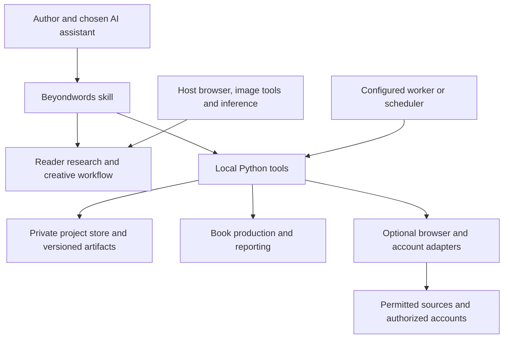

# Under the hood

[← Back to Beyondwords](../README.md) · [Installation](INSTALL.md) · [Dependencies](DEPENDENCIES.md)

Beyondwords has three parts: a portable skill, a deterministic local toolkit and optional adapters. It has no hosted application backend, bundled model weights or mandatory publishing-service subscription.

## Architecture



The host supplies model reasoning and tool access. The skill routes relevant references and asks the tools to perform concrete operations. The local tools persist decisions, validate records, produce files and report explicit capability states.

## Repository map

```text
.agents/skills/beyondwords/
  SKILL.md              Skill entry point and workflow routing
  agents/               Host discovery metadata
  scripts/              Executable Python modules
  references/           Focused workflow and tool contracts
  assets/               Production resources, fonts and API contract notices
assets/                 Public logo, banner and walkthrough
requirements/           Hash-pinned optional dependencies and metadata
tools/                  Installers, package checks and release helpers
packaging/plugin.json   Plugin metadata
.github/workflows/      Cross-platform package checks
docs/                   User and technical guides
FILE_MANIFEST.json      Release file sizes and SHA-256 hashes
VERSION                 Public release version
```

Author work belongs in a separate private workspace. The release contains no private projects, account sessions, old test runs or development conversation history.

## Main modules

| Responsibility | Modules in the skill's `scripts/` directory |
|---|---|
| Entry point and results | `beyondwords.py`, `publishing_result.py` |
| Store, projects and artifacts | `publishing_core.py`, `publishing_project.py`, `beyondwords_book.py` |
| Intake and workflow | `beyondwords_guide.py`, `beyondwords_lifecycle.py`, `beyondwords_desks.py` |
| Research and source capture | `publishing_research.py`, `publishing_browser.py`, `publishing_extract.py`, `beyondwords_research_tools.py`, `beyondwords_browser_handoff.py` |
| Writing and editorial | `beyondwords_authoring.py`, `beyondwords_editorial.py` |
| Production and design | `beyondwords_production.py`, `beyondwords_visual.py`, `beyondwords_coloring.py`, `beyondwords_docx.py` |
| Publishing and accounts | `beyondwords_publisher.py`, `beyondwords_publishing_checks.py`, `beyondwords_connected.py` |
| Advertising and economics | `beyondwords_amazon_ads.py`, `beyondwords_campaign.py`, `beyondwords_business.py`, `beyondwords_market.py` |
| Hosts and monitoring | `beyondwords_hosts.py`, `beyondwords_monitor.py`, `beyondwords_mcp.py` |

## Run the CLI

From the source root, using Python 3.11+ or the installed runtime:

```sh
python3 .agents/skills/beyondwords/scripts/beyondwords.py --help
python3 .agents/skills/beyondwords/scripts/beyondwords.py doctor
```

Commands cover project initialization/status, guided intake, research, plans, chapters, manuscript import, story memory, editorial work, assets, cover composition, export, publishing checks, finance, reports and connected actions. Inspect the relevant command's help before using it. JSON outputs distinguish successful operations, missing information, blocked operations and unverified capabilities.

`doctor` performs local detection. It does not prove that a browser can reach a particular source or that an account action is authorized. See the [tool map](../.agents/skills/beyondwords/references/09-tool-map.md) and [local workflow](../.agents/skills/beyondwords/references/10-local-workflow.md) for detailed contracts.

## State, evidence and recovery

- Versioned project records and explicit identifiers keep authors and books separate.
- Revision checks, local transactions and durable action records support concurrent access and recovery.
- Artifact hashes bind reviews and publishing packages to specific files; changed inputs can invalidate prior approvals.
- Source captures record scope and provenance. Policy changes are preserved for review before affecting checks.
- Uncertain external outcomes require reconciliation. A timeout is not permission to repeat a publishing or spending action.
- Imported pages and manuscripts are treated as source data, not instructions to operate the host.

These controls reduce concrete failure modes; they do not authenticate the truth of source material or prove commercial readiness. Read the [connected work contract](../.agents/skills/beyondwords/references/20-connected-work.md) and [runtime contract](../.agents/skills/beyondwords/references/21-connected-runtime.md) before extending adapters.

## Optional integrations

**Browser:** a normal host browser is preferred for research. The local read-only Playwright/Chromium path supports permitted capture. No CAPTCHA bypass, stealth access or account login is part of research collection.

**Publishing:** attended browser workflows need the real owner's session and reviewed scope. There is no fabricated KDP upload API.

**Amazon Ads:** the adapter uses the official API contract. Credentials, profile access, eligibility, request limits, budgets and authorization are external requirements. Reports can also be imported without connecting an account.

**MCP:** the optional official Python SDK exposes a local STDIO server scoped to a selected workspace and project. The setup helper writes a reviewable configuration. It does not host a remote MCP service.

**Monitoring:** the local worker and scheduler handoff track actual runs. Persistent execution needs a configured environment; the skill itself is not a scheduler.

## Reproducible package checks

Run from a clean release checkout:

```sh
python3 tools/check_public_package.py
```

The checker verifies manifest paths, file sizes and hashes, Python syntax, portable skill metadata, a temporary isolated install, local `doctor` output and refusal to overwrite an existing installation. It does not use accounts, inference or market data. Temporary state is removed.

The public workflow runs these checks on Linux, macOS and Windows with Python 3.12. Read the actual [Actions results](https://github.com/beyondtahir/beyondwords/actions/workflows/package.yml) for the current commit. This is package verification, not a claim that all host integrations or live accounts passed. Optional production/browser dependencies are not installed by that lightweight workflow.

For a reviewed derivative, `tools/build_release.py --destination NEW_DIRECTORY` rebuilds archives and their file manifest from the allowed source tree. Changes to release files require a fresh manifest before the package checker can pass. The builder refuses to overwrite a destination. Original code is MIT; keep third-party notices intact.

## Extending Beyondwords

Add deterministic behavior in a focused Python module and route it through the existing CLI/tool contracts. Keep editorial judgment and mode-specific guidance in the relevant skill reference. Preserve existing project data, version records that change meaning and test failure/recovery behavior as well as the successful path.

New dependencies should be justified, reviewed, pinned with hashes and documented. New connectors need explicit capability states, scoped authorization and uncertain-outcome handling. Host compatibility should be verified in the real environment before being advertised as tested.

A tested local-inference setup, broader host/account acceptance and further specialist layout validation remain future work. The current interface is model-replaceable; it does not claim those validation tasks are already complete.
